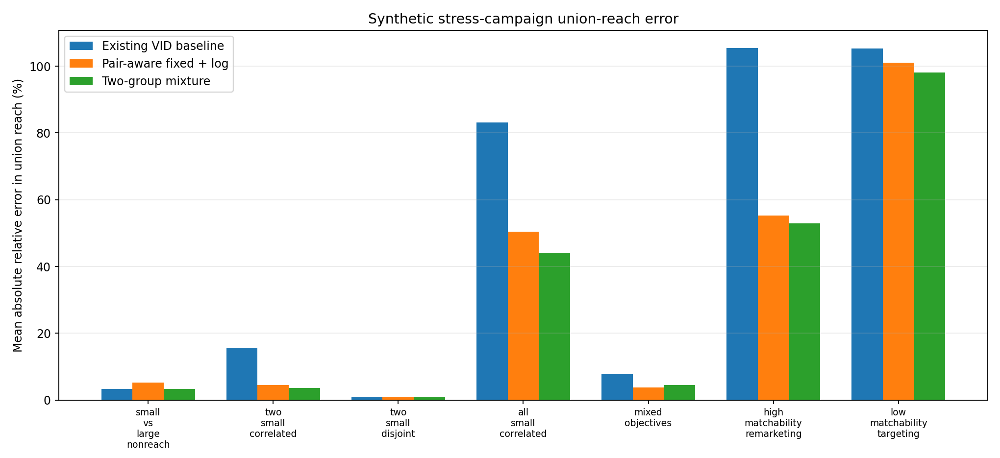
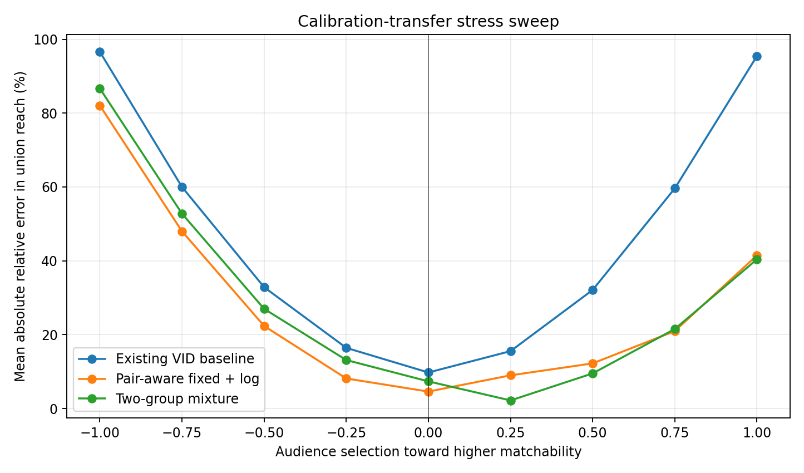

# Reference-ID Calibration: Synthetic Implementation and Validation

This paper validates the system defined in the [Reference-ID Calibration and Cross-Report Reconciliation design](https://docs.google.com/document/d/1CTtFht8E46DnqJMSDVoSrMrgRyjnR2M2NAF3WFs2RXw/edit). It is written to stand on its own, but the companion design contains the complete production interfaces and rollout plan.

## Decision summary

This prototype shows that Reference-ID calibration can be implemented without linking a Virtual ID (VID) to a Reference ID and can be applied to reports containing any subset of a ten-EDP roster. Averaged across the synthetic non-representative stress set, both tested calibration models improve union-reach accuracy, although neither improves every scenario. The two-group mixture performs best overall, while the pair-aware fixed-plus-log model is easier to explain, directly represents unusually strong or weak EDP pairs, and performs better in some mixed-objective cases.

The recommended first implementation is the pair-aware fixed-plus-log model, with the two-group mixture retained as a challenger. That recommendation is about implementation clarity, not a claim that the pair-aware model is inherently more accurate. The final choice should be made with whole-campaign holdouts from approved real calibration data.

The stored-result consistency layer also worked on the normal generated report requests: exact repeats were identical, earlier reports were never rewritten, and no monotonic or set-coverage inequality violations remained. A separate failure fixture began with deliberately contradictory historical results; the new report was still produced and was flagged for review. This is strong evidence that the proposed workflow is implementable, but it is not proof that its calibration assumptions transfer to real campaigns.

## Problem statement

Existing VID models are expected to estimate union reach well when the campaigns being combined resemble the broad-reach campaigns used to build or validate the model. They can be much less reliable when one or more campaigns select an unusual audience—for example, a small retargeting campaign compared with a much larger reach campaign, or two small campaigns aimed at nearly the same people.

Reference-ID calibration adds a second aggregate measurement. Each EDP derives a Reference ID from one agreed join key, normally email, and otherwise falls back to its own proprietary identifier. The result is hashed into a shared space of five billion values. Proprietary fallback identifiers are not coordinated across EDPs, so they match only through random hash collisions. All matching and counting is assumed to occur inside an attested trusted execution environment. The approved workload can use the Reference IDs, but no party receives an identity graph or learns whether a particular Reference ID came from email or from an EDP-specific fallback.

The method uses large, representative campaigns to learn how much true cross-EDP overlap is normally visible through Reference IDs. Future reports then combine the ordinary VID estimates with newly observed Reference-ID intersections. Only aggregate measurements are connected: the prototype never links a person's VID to that person's Reference ID.

## What the implementation does

For each participating EDP subset S, the measurement supplies:

- the individual VID reach for each EDP;
- the ordinary VID estimate of the intersection, K0_S;
- the observed Reference-ID intersection, J_S; and
- the expected random-collision contribution from hashing into the five-billion-value pool, F_S.

On representative calibration campaigns, the system estimates the Reference-ID capture rate:

*r_S ≈ (J_S − F_S) / K0_S*

For a future report, it corrects the intersection using:

*corrected intersection_S = (J_S − F_S) / predicted capture rate_S*

All pairwise, three-way, four-way, and higher-order intersections are measured. With ten EDPs, that is 1,013 intersections in addition to the ten individual EDP reaches. Calibration fitting excludes observations that fail the predeclared minimum-volume or quality rules, but the fitted model can produce a capture-rate estimate for every subset. The corrected intersections are noisy and may not form a valid Venn diagram on their own, so the implementation fits one set of nonnegative exclusive audience cells while holding each EDP's individual VID reach fixed. Every requested union is calculated from those cells.

Weak high-order observations are partially pulled toward the ordinary VID result rather than allowing a zero- or one-person synthetic match to be magnified into an implausible population estimate. This is a variance-control rule, not a claim that the VID estimate is always correct.

## The two calibration models

### 1. Pair-aware fixed plus campaign-size effect

For two EDPs, the model learns the usual Reference-ID capture rate for that pair and, if holdout data justifies it, a shared adjustment based on campaign size. In simplified form:

*logit(r_ij) = two-way baseline + pair effect_ij + β × ln(g_ij)*

where g_ij is the geometric mean of the two EDP reach fractions. The logarithm is used because audience sizes can span orders of magnitude; it allows a gradual size effect without letting predictions leave the zero-to-one range.

For larger subsets, the same idea is extended with one baseline for each overlap order and the average of the pair effects inside the subset. At ten EDPs the tested versions require:

| Version | Parameters |
|---|---:|
| Fixed, no size effect | 53 |
| One shared log-size effect | 54 |
| A separate log-size effect by overlap order | 62 |

The 53 fixed parameters are nine overlap-order baselines plus 44 independent pair effects. There are 45 EDP pairs, but one centering constraint removes one free parameter. The full run selected the 54-parameter shared-log version: its representative-campaign holdout p90 error was 6.86%, compared with 10.15% for the fixed version. The order-specific slopes improved p90 only to 6.76%, which was not enough to justify eight more parameters.

This run used a logit link, which keeps every predicted capture rate between zero and one. It did not test the simpler direct form c_ij = a_ij + b_2 ln(g_ij). The direct form is easier to interpret and should be added to real-data model comparison, with fitting constraints that keep its predictions valid throughout the approved campaign-size range.

Why this model may be right: different EDP pairs can genuinely have different email agreement, and small versus large campaigns may expose those matches at different rates. Its coefficients also have a relatively direct interpretation.

Main risk: averaging pair effects may miss person-level correlation that appears only when three or more EDPs are combined.

### 2. Two-group matchability mixture

This model represents two unobserved groups of people: one group that is generally easier to match across EDPs and one that is harder. Each EDP has a linkage probability in each group, plus one parameter for the population split. For subset S:

*r_S = π × product(q_i,low) + (1 − π) × product(q_i,high), for i in S*

At ten EDPs this requires 21 parameters. It produces all 1,013 capture rates from one coherent structure rather than fitting 1,013 unrelated curves.

Why this model may be right: people who provide the same usable email at one EDP may be more likely to do so elsewhere. That positive person-level correlation naturally produces more three-way and higher-order Reference-ID matches than a simple product of average EDP linkage rates.

Main risks: the two groups are not directly observed, their parameters can be difficult to identify from aggregates, and two groups may still be too simple. It also does not directly represent a uniquely strong or weak EDP pair.

## Model fitting and versioning

The full run used 24 large representative campaigns for fitting and eight different campaigns for holdout evaluation. All snapshots from one campaign stay in the same fold, so repeated cumulative checkpoints are not incorrectly treated as independent campaigns. Fitting weights are balanced so no campaign's checkpoints can dominate, and overlap orders with many possible subsets are downweighted. The richer pair-aware version is selected only when it materially improves whole-campaign holdout performance; otherwise the simpler fixed model is retained.

The fitted calibration is versioned with the model line and Reference-ID derivation. A new model line may be produced every three months, while a particular line can remain usable for 15 months or longer. A report uses the model line containing the events being measured, including an older line when the requested data is historical. It does not refit calibration parameters for each report.

Fitting can run inside the TEE. If governance permits, the TEE can instead export anonymous aggregate calibration records or narrower model-specific statistics for external fitting. The synthetic implementation writes a versioned model artifact containing every fitted parameter needed to reproduce later predictions.

## Cross-report consistency

Each finalized result is stored under a key containing the campaign, model line, Reference-ID source version, population definition, exact week set, EDP set, and calibration model. An exact repeat returns the stored value.

For a new report, previously finalized reports remain fixed. The new union is moved only as much as necessary to satisfy applicable relationships, including:

- adding weeks or EDPs cannot reduce cumulative union reach; and
- when the combined scope and common scope have both been reported, their reaches together cannot exceed the sum of the two original report reaches.

If all requirements cannot be satisfied simultaneously, the service still returns a bounded result but marks it for review and records the unresolved amount. It never silently rewrites a prior report.

This approach preserves consistency among the results that have actually been finalized. It does not mean the system has precomputed one perfect audience map for every report anyone might ask for in the future. If a larger report publishes internal subset totals, each published subtotal must also be registered as a finalized result; otherwise the guarantee applies only to the report's requested top-level union.

The measurement layer is roster-invariant: the same campaign, week set, and EDP subset produces identical VID and Reference-ID aggregate inputs whether measured alone or inside a larger EDP roster. Both calibration formulas are also subset-local, so unreported EDPs do not change a subset's predicted capture rate. Joint Venn decoding can still move an internal subtotal when additional EDPs are present; that is why any subtotal shown to users must be finalized and registered rather than treated as an untracked intermediate value.

## Synthetic test design

The full profile represents a population of 120 million with 30,000 weighted synthetic people, ten EDPs, thirteen weeks, and a five-billion-value Reference-ID pool. Email availability ranges from 95% to 10% across EDPs, and conditional agreement ranges from 72% to 52%, centered around the requested roughly 60% match rate. Latent global and EDP-pair factors create realistic correlation and allow some pairs to match materially better than others.

The collision floor uses an independent-occupancy approximation and receives a deterministic random draw keyed by campaign, week set, and EDP subset; the harness does not allocate billions of literal identifiers. The exact production collision estimator still needs validation when genuine shared emails and accidental bucket collisions coexist.

The ordinary VID baseline is deliberately simplified: it uses the correct individual reach for each EDP and population-rate overlap. This isolates the overlap-calibration question, but it is not a reproduction of a production VID model. Therefore the numerical comparison with the baseline is illustrative rather than a forecast of production improvement.

The harness validates total union reach only. It does not test frequency histograms or demographic allocation. Overall average frequency can be recomputed from the unchanged impression total and calibrated reach, but the Reference-ID signal does not identify the corrected frequency distribution.

Because Reference IDs have no demographic labels, every VID demographic estimate receives the same percentage adjustment. Impossible values must be moved to the nearest valid value and flagged. The method cannot learn that one demographic needs a different correction from another.

Stress campaigns include representative broad reach, a small non-reach campaign compared with larger reach campaigns, two small correlated campaigns, two small disjoint campaigns, several small correlated campaigns, mixed objectives, high-matchability remarketing-like selection, and low-matchability targeting. Weekly delivery is bursty rather than linear.

Requests include weeks 1–3 followed later by weeks 1–12, weeks 5–12 for two EDPs, weeks 7–13 for five EDPs, full-flight reports for two, five, and ten EDPs, and a noncontiguous week set. Request order is permuted. Both positive and negative shifts in campaign matchability are tested separately.

## Accuracy results

Across the nominal stress set, excluding deliberate matchability-transfer shifts, each requested report contributes equally to the averages:

| Method | Mean absolute relative error | p90 | p99 |
|---|---:|---:|---:|
| Existing VID baseline | 18.55% | 56.37% | 190.32% |
| Pair-aware fixed + log | 11.20% | 36.93% | 116.95% |
| Two-group mixture | 9.82% | 27.61% | 111.43% |

Relative error can exceed 100% when the true union is small. The error distribution is dominated by the deliberately difficult all-small correlated campaigns.

Selected examples show the intended use case more directly:

| Campaign and report | Existing VID | Pair-aware | Mixture |
|---|---:|---:|---:|
| Small non-reach vs. large reach, weeks 5–12, 2 EDPs | 6.29% | 2.09% | 0.52% |
| Two small correlated campaigns, full flight, 2 EDPs | 49.14% | 16.07% | 4.55% |
| All-small correlated, weeks 7–13, 5 EDPs | 77.99% | 44.82% | 36.83% |
| Mixed objectives, full flight, 10 EDPs | 15.08% | 4.17% | 5.87% |

Performance by report size:

| EDPs in report | Existing VID | Pair-aware | Mixture |
|---:|---:|---:|---:|
| 2 | 9.75% | 4.21% | 2.34% |
| 5 | 14.40% | 9.40% | 8.20% |
| 10 | 35.65% | 21.80% | 20.54% |

The existing VID baseline remains best on representative campaigns by construction: 0.37% mean error versus 2.16% and 2.36% for the calibrated models. Calibration adds Reference-ID measurement noise when the ordinary model is already right. This argues against treating the synthetic averages as justification for replacing every VID result unconditionally.

## Transfer risk

The most important unresolved risk is transfer of the learned Reference-ID capture rates. The stress sweep deliberately selects campaigns toward people who are easier or harder to match than the representative calibration population.

| Matchability shift | Existing VID | Pair-aware | Mixture |
|---:|---:|---:|---:|
| Strongly lower (-1.00) | 96.60% | 82.05% | 86.67% |
| Moderate lower (-0.50) | 32.85% | 22.35% | 26.99% |
| No direct shift (0.00) | 9.75% | 4.58% | 7.35% |
| Moderate higher (+0.50) | 32.11% | 12.22% | 9.51% |
| Strongly higher (+1.00) | 95.46% | 41.47% | 40.40% |

Both calibration models help over much of this synthetic sweep, but neither solves severe transfer failure. A pairwise residual diagnostic correlates strongly with the injected shift (0.87–0.88), yet it also changes when the true audience overlap changes. It can prioritize reports for review but is not reliable enough to decide automatically that calibration is safe or unsafe.

## Consistency results

Across 1,152 finalized synthetic report results:

- exact-repeat failures: 0;
- monotonic checks: 2,496, with 0 violations;
- set-coverage inequality checks: 2,496, with 0 violations;
- observed request-order variation: 0%; and
- prior reports changed by later requests: 0.

The normal generated requests were feasible and did not require review. The zero-violation counts above apply only to those requests after reconciliation. A separate robustness fixture deliberately inserted impossible history—for example, a smaller audience already finalized above a larger audience containing it. No new number can repair that history while keeping prior results frozen. The system nevertheless produced a bounded new result with **REVIEW_REQUIRED**, recorded the unresolved inconsistency, and left the prior results unchanged.

These results validate the mechanics of stored-result reconciliation. They do not prove that every possible sequence of future requests will be feasible or order-independent. The prototype also uses a simple uncertainty proxy for reconciliation; production uncertainty weights still need to be specified and validated.

## Recommendation

Proceed with the pair-aware fixed-plus-log model as the first implementation and keep both the constrained direct form and the mixture model as challengers during real-data validation. The tested pair-aware logit model is easier to inspect, includes plausible EDP-pair differences, scales to ten EDPs with 54 parameters, and was selected over its tested simpler and more complex logit variants by whole-campaign holdouts. The direct form's interpretability and the mixture's better average synthetic accuracy—especially on correlated small campaigns—are strong enough that neither should be discarded without real-data testing.

Before a production choice, repeat this exact protocol with approved aggregate data from real large-reach calibration campaigns and held-out non-reach campaigns. The decision should consider at least:

1. union-reach error by report size and campaign type;
2. pairwise, three-way, four-way, and higher-order residuals separately;
3. performance relative to the existing VID result on the same reports;
4. both upward and downward matchability shifts; and
5. the frequency and magnitude of consistency reconciliation or review flags.

Until that evidence exists, the defensible conclusion is that the system design works mechanically and improves the intended synthetic failure cases, while the correct production calibration model and deployment rule remain empirical questions.

## Reproducing the run

From the repository root, run:

1. ./scripts/bootstrap.sh
2. .venv/bin/python -m unittest discover -s tests -v
3. .venv/bin/reference-calibration-sim --profile full --output-dir outputs/final

The final directory contains the fitted model artifact, machine-readable summary, detailed metrics, generated validation report, and charts. The test suite also verifies report-invariant measurements, model serialization, valid calibrated bounds, required 2/5/10-EDP report shapes, exact repeats, nonnegative Venn decoding, and flagged handling of an infeasible request.
